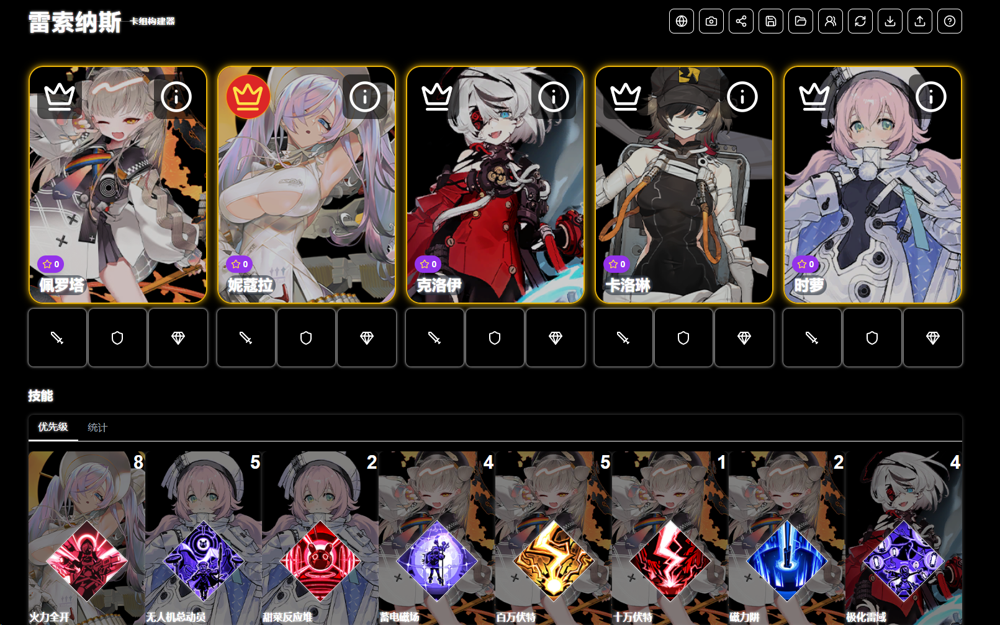

# 雷索纳斯卡组构建器 / Resonance Deck Builder



网站地址：https://rsnswiki-deck-builder.com/

原项目：https://github.com/danij91/resonanceDeckBuilder  
当前维护仓库：https://github.com/DaiMao204/resonanceDeckBuilder

---

## 📖 中文介绍

**雷索纳斯卡组构建器** 是一个用于构建和维护《雷索纳斯》卡组配置的网页工具。

你可以在网页中选择角色、装备、技能卡和战斗设置，导入或导出卡组配置，生成分享链接，也可以保存常用卡组。

### ✨ 主要功能

- **导入卡组**  
  从剪贴板导入游戏或网页生成的卡组代码。

- **导出卡组**  
  将当前编辑后的卡组复制为可复用的配置代码。

- **URL 分享**  
  将当前卡组编码到链接中，方便直接分享给其他玩家。

- **截图保存**  
  一键生成当前卡组配置截图。

- **重置卡组**  
  清空当前角色、卡牌、装备和战斗设置。

- **本地保存 / 读取**  
  将常用卡组保存在浏览器本地，之后可继续读取。

- **多语言支持**  
  支持韩文、英文、日文、简体中文、繁体中文。

- **评论区**  
  支持 Artalk 评论系统。不同语言页面共用同一页面评论区，评论按钮和提示文本会尽量跟随当前界面语言。

### 🛠️ 当前维护版改动

- 默认语言调整为简体中文。
- 调整了页脚组成。
- 默认队伍配置中加入弃牌卡，且弃牌卡不参与统计。
- 评论区改为使用自建 Artalk 服务。
- 优化界面加载和语言切换流程，减少加载时间。

---

## 📖 한국어 소개

**Resonance Deck Builder**는 게임 **Resonance**의 덱 구성을 만들고 관리하기 위한 웹 도구입니다.

웹에서 캐릭터, 장비, 스킬 카드, 전투 설정을 선택하고 덱 구성을 가져오거나 내보낼 수 있으며, 공유 링크를 만들고 자주 쓰는 덱을 저장할 수도 있습니다.

### ✨ 주요 기능

- **덱 가져오기**  
  클립보드에서 게임 또는 웹사이트가 생성한 덱 코드를 가져옵니다.

- **덱 내보내기**  
  현재 편집한 덱을 다시 사용할 수 있는 설정 코드로 복사합니다.

- **URL 공유**  
  현재 덱 구성을 링크에 인코딩하여 다른 플레이어에게 바로 공유할 수 있습니다.

- **스크린샷 저장**  
  현재 덱 구성 화면을 이미지로 저장할 수 있습니다.

- **덱 초기화**  
  현재 캐릭터, 카드, 장비, 전투 설정을 초기화합니다.

- **로컬 저장 / 불러오기**  
  자주 쓰는 덱을 브라우저에 저장하고 나중에 다시 불러올 수 있습니다.

- **다국어 지원**  
  한국어, 영어, 일본어, 간체 중국어, 번체 중국어를 지원합니다.

- **댓글 영역**  
  Artalk 댓글 시스템을 지원합니다. 여러 언어 페이지는 같은 댓글 영역을 공유하며, 버튼과 안내 문구는 가능한 한 현재 UI 언어를 따릅니다.

### 🛠️ 유지보수 버전 변경 사항

- 기본 언어를 간체 중국어로 변경했습니다.
- 푸터 구성을 조정했습니다.
- 기본 덱 구성에 버림 카드가 포함되며, 버림 카드는 통계에 포함되지 않습니다.
- 댓글 영역은 자체 호스팅 Artalk 서비스를 사용하도록 변경했습니다.
- 화면 로딩과 언어 전환 흐름을 최적화하여 로딩 시간을 줄였습니다.

---

## 📖 English Introduction

**Resonance Deck Builder** is a web tool for building and maintaining deck setups for **Resonance**.

You can select characters, equipment, skill cards, and battle settings on the site, import or export deck configurations, generate shareable links, and save frequently used decks.

### ✨ Key Features

- **Import Decks**  
  Import deck codes generated by the game or website from the clipboard.

- **Export Decks**  
  Copy the current edited deck as a reusable configuration code.

- **URL Sharing**  
  Encode the current deck into a link and share it directly with other players.

- **Screenshot Export**  
  Save the current deck setup as an image.

- **Reset Deck**  
  Clear the current characters, cards, equipment, and battle settings.

- **Local Save / Load**  
  Save frequently used decks in the browser and load them later.

- **Multilingual Support**  
  Supports Korean, English, Japanese, Simplified Chinese, and Traditional Chinese.

- **Comments**  
  Supports Artalk comments. Pages in different languages share the same comment thread, while buttons and hints try to follow the current UI language.

### 🛠️ Maintained Fork Changes

- Changed the default language to Simplified Chinese.
- Adjusted the footer structure.
- Added a default discard card to team setups, and excluded it from statistics.
- Reworked comments to use a self-hosted Artalk service.
- Optimized interface loading and language switching to reduce loading time.

---

## ⚙️ 技术栈


- React 19
- Next.js 15
- Tailwind CSS
- Artalk 评论系统
- Vercel 部署

---

## 💻 本地运行

### 📋 环境要求

- Node.js 18 或更高版本
- npm

### 📦 安装依赖

```bash
npm install
```

### 🚀 本地开发

```bash
npm run dev
```

默认访问：

```text
http://localhost:3000
```

### 🏗️ 构建

```bash
npm run build
```

### ▶️ 生产启动

```bash
npm run start
```

## 🔗 部署说明

当前建议使用 Vercel 部署。

- `main`：主开发分支。
- `vercel-deploy`：生产部署分支。
- 推送 `main` 后，将 `main` 合并到 `vercel-deploy`。
- 推送 `vercel-deploy` 后会触发 Vercel 生产部署。

---

## 🙏 鸣谢

- 原作者：Heeyong Chang  
  原项目：https://github.com/danij91/resonanceDeckBuilder

- 当前维护：DaiMao / 呆毛  
  维护仓库：https://github.com/DaiMao204/resonanceDeckBuilder

- 雷索纳斯官网：https://soli-reso.com
- 雷索纳斯 Wiki：https://wiki.biligame.com/resonance

---

## 📝 许可证

This project is licensed under the [GNU General Public License v3.0](./LICENSE).  
本项目基于 [GNU General Public License v3.0](./LICENSE) 开源。

See the LICENSE file for more information.
